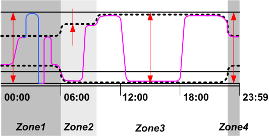
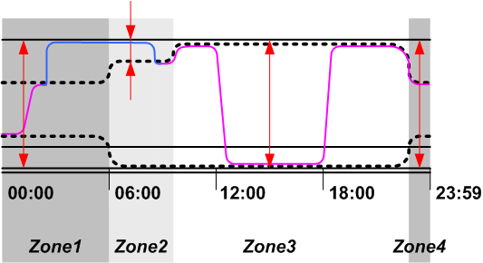
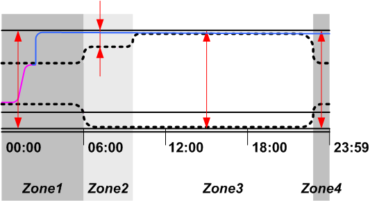
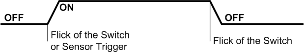
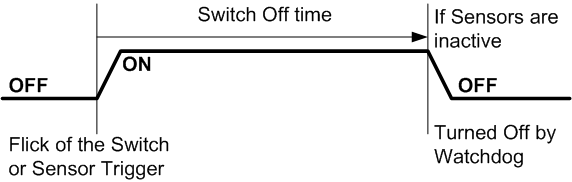
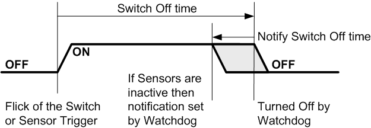
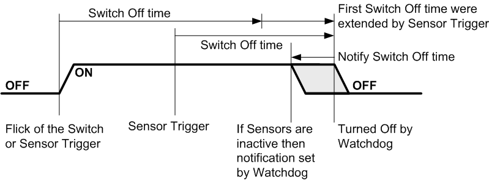
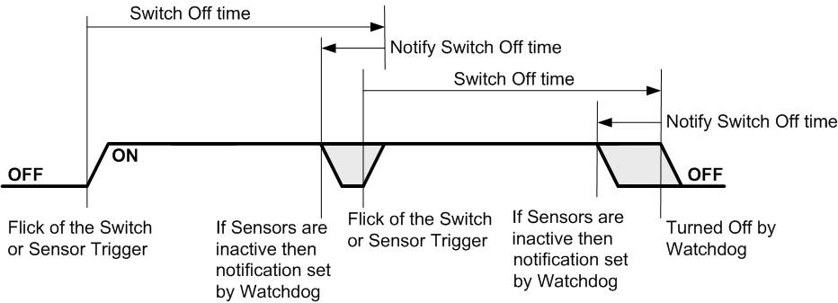
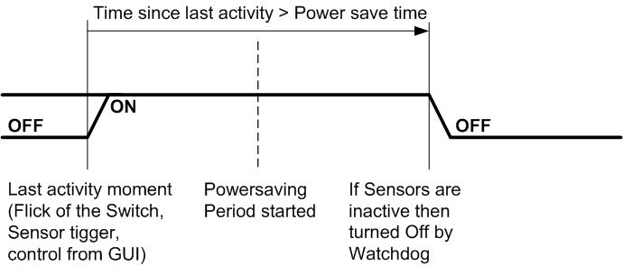
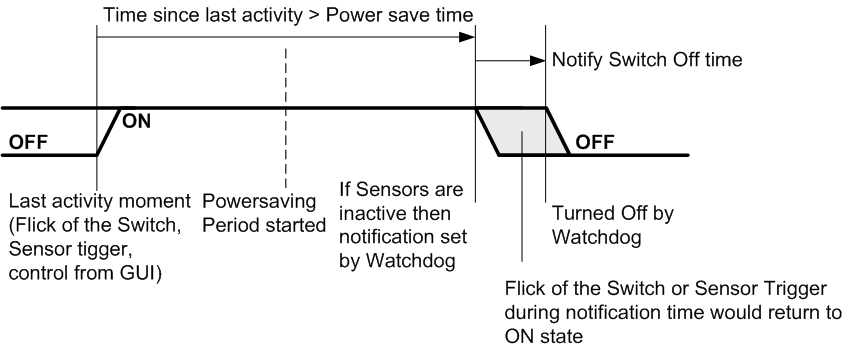

# Basics explanations

As you probably read in the docs there is following terms:

1. Light Entity: An object that can be toggled ON/OFF and which brightness could be set (optionally)
2. `ON state` and `OFF state`: defines state for Light Entity when it's toggled ON or OFF
3. Black Out: No power is sourced to Light Entity (i.e. when it's literally off)
4. Switch Button: An object that provides certain events according to user's interactions with it. Events are used for toggling Lights ON and OFF
5. Sensor: An object that update's it's state according to environment and may provide events when it's state changes
6. Automatic Switch Off Timeout (further just SwitchOff): Time before automatically toggle Light Entity off after it were toggled ON
7. Power save time: Time of inactivity (time since there were event that toggles Lights off) after which Lights should be switched off automatically

It's explained below how those things work together

# ON and OFF states

It's assumed that Light Entity could be turned ON with brightness level from 0 to 255, or could be completely turned OFF
(blacked out).

What state Light Entity would be toggled to is defined by `ON state` and `OFF state`.

Event if it's called `ON state`, it can define that Lights should be turned off actually and vice-versa
`OFF state` can define that Lights can be turned on.

By default `ON state` corresponds to lights on with brightness 255, `OFF state` corresponds to blackout.

On diagrams below Light State defined as shown below:

Bottom double line corresponds to black out, a bit higher line corresponds to light on with brightness 0, 
on top - light on with brightness 255.

## ON and OFF states schedule

There is not much sense in static ON and OFF states and usually they are scheduled.

You may define different ON and OFF states for certain periods of time.

Example of such schedule is shown on diagram below:

Top dotted line depicts ON state schedule and  bottom dotted OFF state schedule

Toggling lights on and off would actually toggle lights between these states and it would depend
on time when lights were toggled.

## Dynamic lighting

ON and OFF states not just define to which state Light Entity would be toggled. 
Light Entity state also would be automatically updated as time flows. 

How often light state would be checked against schedule depends on how often LightsControl Watchdog 
service is called. Normally 1 second period is fine.

Diagram below shows how state of Light Entity is changed by toggle events and during time.

Magenta line depicts actual state of Light Entity.

There is following toggle events:
1. Zone1: OFF to ON then ON to OFF
2. Zone2: OFF to ON
3. Zone3: ON to OFF, then OFF to ON
4. Zone4: no toggle events

As time crossed border between Zone1 to Zone2 Light's state were automatically updated.
Same for other zones borders.

## Going beyond boundaries

Some times it's necessary to turn light completely on or off, no matter what schedule is.

This can be achieved via GUI or with special switch button events with `magic` field set.

Magic events not only toggles light to maximum or blackout states.
When light were toggled to a state that don't corresponds to it's schedule (`override state`), 
that state would remain even after time crossed zone boundary (TODO: or if associated sensor 
becomes active). But need to say that other automation would still work and 
light could be toggled off according to automatic switch off or power savings.

Here comes real magic, since behavior depends both on light's state and schedule.
To get back Light Entity to state that is defined to a schedule you may do:

1. Invoke event associated with that light and without `magic` field set.

Diagrams below show few cases how `magic` events can be applied to Dynamic State diagram (see above).

Blue lines depicts state of Light Entity when it's in `override state`.

### Case 1 (Normal-Maximum-Blackout)

In this case there is two `magic` events in Zone 1. First toggles lights to maximum brightness as lights are already on. Second toggles lights
completely off (Black Out) as normal OFF state has some brightness set in this zone. After that light is toggled to normal ON state (also in Zone 1) by simple (non magic) toggle event in again Zone 1.

### Case 2 (Normal-Maximum-Normal)

In this case light is toggled to maximum brightness in Zone 1 and with `magic` event as in previous case. Then this state is retained until light is toggled back to normal ON in Zone 2 with second `magic` event. Notice - since OFF state in Zone 2 is equal to Completely off, magic event toggles lights between normal ON state and Maximum brightness.

### Case 3 (Normal-Maximum)

In this case light is toggled to maximum brightness in Zone 1 and it remains in that state as no more toggle event happens (ant no power savings set).

# Timings

Here are timings diagrams explaining how Lights are turned ON and OFF by different rules

## Switched ON by sensor or switch button ON, switched OFF by button

Take a note: Sensor can toggled lights ON but not OFF

## Switched OFF automatically with SWITCH_OFF

Switch buttons and Sensor have `switch_off` option to automatically toggle lights OFF after certain period of time. Even though it's optional for both, Sensors would use `sensor_default_switch_off` if `switch_off` option is not specified (so Lights would always toggle OFF in case if they were toggled ON by Sensor). 

## Extending ON time and Switch OFF Notification

If Sensor's event occurs while Lights are toggled ON it may prolong ON time (in case if Sensor's event moment + Sensor's switch_off option are later than current scheduled switch_off time).

There is rules section called `notify_turn_off` that can be applied to Light Entities. It defines moment of special notification event before light would be turned off. Notification can be of two types: quick light blinking or light brightness change.

After notification has been made any Sensor's or Switch Button's event would cancel current switch-off schedule. If Lights were dimmed then they would get back to normal state. If that switch-off break event had `swtich_off` option then next switch-off time would be scheduled.

Below are diagrams for described behavior.

### Case 1 (Simple Switch-off Notification )

### Case 2 (Switch-off Notification with ON time prolongation)

### Case3 (Switch-off Breaking)

## Power Savings

Besides `switch_off` option there is `power_save` rules section that describes automatic switch-off. It defines amount of time since last activity with Light entity after which lights would be turned off. Every rule can be applied to multiple lights and every rules can be restricted to certain period of time, so complex setup can be made. These rules comes in handy to turn light off when in night etc.

Powersaving rules respects switch-off notifications as well so you may not be scared to find yourself in complete darkness unexpectedly. Switch-off breaking with Sensor's or Switch button's event works to as with common switch-off.

